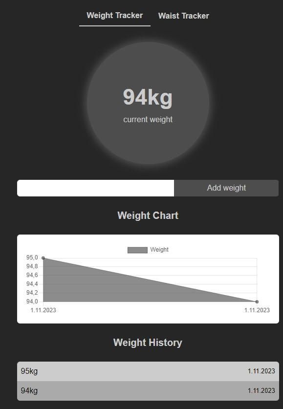

# Calories Calculator

This application will help you to achive your goals(loss weight, increase weight or just stay fit and healthy)

Stack in this project:
 

 

Application link:
https://kalkulatorkalorii-7b44e.web.app/

credentials for test account:
- login: test@test.com  
- password: test123

## Some screens from application

Auth View

  
  

Main View

  

Calc Caloric Need View

  
  

Add Product View

  
  
  
  

Trackers View

  
  

